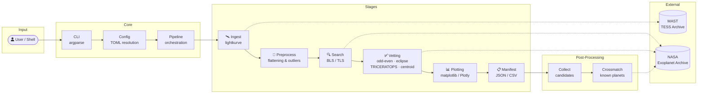
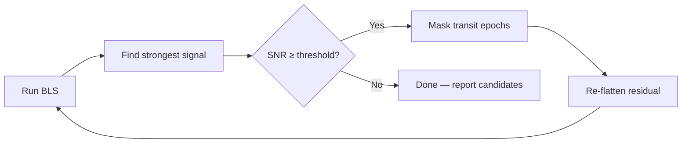

<div align="center">


<br />

[](https://www.python.org)
[](https://github.com/gbFinch/exoplanets-hunting-pipeline/actions)
[](LICENSE)
[](#)

**Ingest, preprocess, search, vet, and cross-match transit signals**
**from raw TESS data to novel planet candidates — in a single reproducible pipeline.**

[Quick Start](#-quick-start) · [Documentation](#-cli-reference) · [Architecture](#-architecture) · [Contributing](#-development)

</div>

<br />

## 📸 Example Outputs

<p align="center">
  
  &nbsp;
  
</p>
<p align="center">
  <sub><b>Left:</b> Cleaned & flattened TESS light curve &nbsp;·&nbsp; <b>Right:</b> BLS transit search diagnostics with phase-folded candidate</sub>
</p>

---

## 📋 Table of Contents

<details>
<summary>Click to expand</summary>

- [Features](#-features)
- [Architecture](#-architecture)
- [Quick Start](#-quick-start)
- [CLI Reference](#-cli-reference)
- [Configuration](#-configuration)
- [Iterative BLS Planet Search](#-iterative-bls-planet-search)
- [Systematic Planet Search Workflow](#-systematic-planet-search-workflow)
- [Pre-Built Target Lists](#-pre-built-target-lists)
- [Output Structure](#-output-structure)
- [Reproducibility](#-reproducibility)
- [Development](#-development)
- [Acknowledgments](#-acknowledgments)
- [License](#-license)

</details>

---

## ✨ Features

<table>
<tr>
<td width="50%">

🔬 **Five-Stage Pipeline**
Ingest → Preprocess → Search → Vet → Manifest, fully configurable per stage

🔍 **BLS & TLS Transit Search**
Box Least Squares with iterative multi-planet masking, plus Transit Least Squares

✅ **Automated Vetting**
Odd/even depth · secondary eclipse · TRICERATOPS FPP · centroid analysis

🔄 **Resumable Batch Processing**
Run thousands of targets with checkpointing and `.done` sentinels

</td>
<td width="50%">

🌐 **NASA Archive Cross-Matching**
Label candidates as `KNOWN`, `HARMONIC`, or `NEW`

⚡ **Built-In Presets**
`quicklook` · `science-default` · `deep-search`

📊 **Deterministic Artifacts**
Config fingerprints, software versions, manifest hashes

🔀 **Per-Sector or Stitched Modes**
Independently configurable for preprocessing, plotting, and BLS

</td>
</tr>
</table>

---

## 🏗 Architecture



<div align="center">
<sub>All persistence is local filesystem under <code>outputs/</code>. No database, no server, no external state.</sub>
</div>

<br />

> **Key modules:** `pipeline.py` (orchestration) · `config.py` (TOML resolution) · `bls.py` / `tls.py` (search) · `vetting.py` (candidate validation) · `batch.py` (multi-target runner) · `collect.py` / `crossmatch.py` (aggregation)

---

## 🚀 Quick Start

### Prerequisites

- Python ≥ 3.10
- Internet access (MAST / NASA archive queries)

### Install

```bash
git clone https://github.com/gbFinch/exoplanets-hunting-pipeline.git
cd exoplanets-hunting-pipeline

python -m venv .venv
source .venv/bin/activate
pip install -e .
```

<details>
<summary><b>Optional extras</b></summary>

```bash
pip install -e ".[plotting]"   # Plotly interactive HTML plots
pip install -e ".[dev]"        # ruff, pytest, mypy, pre-commit
```

</details>

### Run your first target

```bash
python -m exohunt.cli run --target "TIC 261136679" --config quicklook
```

> 💡 This downloads TESS data from MAST, preprocesses the light curve, runs BLS transit search, vets candidates, and writes all artifacts to `outputs/`.

---

## 📖 CLI Reference

<details open>
<summary><b>Single target</b></summary>

```bash
python -m exohunt.cli run --target "TIC 261136679" --config science-default
```

</details>

<details>
<summary><b>Batch mode (resumable)</b></summary>

```bash
python -m exohunt.cli batch \
  --targets-file .docs/targets_premium.txt \
  --config science-default \
  --resume
```

Targets file format — one per line, blank lines and `#` comments ignored:

```text
TIC 261136679
TIC 172900988
TIC 139270665
```

</details>

<details>
<summary><b>Initialize a custom config</b></summary>

```bash
python -m exohunt.cli init-config --from science-default --out ./configs/myrun.toml
```

</details>

<details>
<summary><b>Post-processing</b></summary>

```bash
python -m exohunt.collect                    # Aggregate all passed candidates
python -m exohunt.collect --iterative-only   # Only iteration ≥ 1 candidates
python -m exohunt.collect --all              # Include failed vetting too
python -m exohunt.crossmatch                 # Cross-reference NASA Exoplanet Archive
```

</details>

---

## ⚙ Configuration

Exohunt uses TOML configuration with three built-in presets:

| Preset | Use Case | BLS Iterations | Period Range |
|:-------|:---------|:--------------:|:------------:|
| 🟢 `quicklook` | Fast inspection | 1 | 0.5 – 20 d |
| 🔵 `science-default` | Balanced analysis | 1 | 0.5 – 20 d |
| 🟣 `deep-search` | Multi-planet hunt | 3 | 0.5 – 25 d |

```bash
python -m exohunt.cli init-config --from deep-search --out ./configs/custom.toml
```

> 📄 See [`examples/config-example-full.toml`](examples/config-example-full.toml) for all available fields with inline documentation.

---

## 🔄 Iterative BLS Planet Search

Exohunt supports iterative BLS for multi-planet detection. After each pass, detected transit epochs are masked and the search repeats on the residual — recovering secondary planets hidden under the primary signal.



<details>
<summary><b>Enable iterative search</b></summary>

```toml
# configs/iterative.toml
schema_version = 1
preset = "science-default"

[bls]
iterative_masking = true
iterative_passes = 5
min_snr = 5.0
n_periods = 4000
period_max_days = 25.0
```

Or use the `deep-search` preset which enables iterative BLS by default.

</details>

---

## 🔬 Systematic Planet Search Workflow

```bash
# 1️⃣  Run batch analysis on high-value targets
python -m exohunt.cli batch \
  --targets-file .docs/targets_premium.txt \
  --config ./configs/iterative.toml \
  --resume --no-cache

# 2️⃣  Collect all passed candidates
python -m exohunt.collect

# 3️⃣  Cross-reference against NASA Exoplanet Archive
python -m exohunt.crossmatch

# 4️⃣  (Optional) Clean light curve cache to reclaim disk space
rm -rf outputs/cache/lightcurves
```

**Cross-match labels:**

| Label | Meaning |
|:------|:--------|
| 🟢 `KNOWN` | Matches a confirmed exoplanet period |
| 🟡 `HARMONIC` | Matches a harmonic (0.5×, 2×, 3×) of a known planet |
| 🔴 `NEW` | No match found — **worth manual review** |

Results: `outputs/candidates_summary.json` → `outputs/candidates_crossmatched.json`

---

## 🗂 Pre-Built Target Lists

Curated from the [ExoFOP](https://exofop.ipac.caltech.edu/tess/) TOI catalog — single-TOI systems (1 known planet, no eclipsing binaries) sorted by TESS sector count.

| Tier | File | Targets | Criteria | Est. Runtime |
|:----:|:-----|--------:|:---------|:------------:|
| 🥇 | [targets_premium.txt](.docs/targets_premium.txt) | ~200 | Tmag < 11, ≥ 10 sectors | ~40 hours |
| 🥈 | [targets_standard.txt](.docs/targets_standard.txt) | ~1,100 | Tmag < 13, ≥ 5 sectors | ~9 days |
| 🥉 | [targets_extended.txt](.docs/targets_extended.txt) | ~1,900 | Tmag < 14, ≥ 3 sectors | ~16 days |
| 🌐 | [targets_all.txt](.docs/targets_iterative_search.txt) | ~3,200 | All tiers combined | ~27 days |

> **💡 Tip:** Start with premium, then expand. The `--resume` flag skips already-processed targets.

---

## 📁 Output Structure

```
outputs/
├── 📂 cache/lightcurves/           # Downloaded TESS data (.npz)
├── 📂 <target>/
│   ├── 📊 plots/                   # Light curve & diagnostic plots
│   ├── 🔍 candidates/              # BLS candidates (CSV + JSON)
│   ├── 🩺 diagnostics/             # Vetting detail files
│   ├── 📈 metrics/                 # Per-target metrics
│   └── 📋 manifests/               # Run manifests & comparison keys
├── 📂 batch/                       # Batch status & resumable state
├── 📄 candidates_summary.json      # Aggregated candidates (from collect)
└── 📄 candidates_crossmatched.json # With NASA archive labels (from crossmatch)
```

<details>
<summary><b>Example candidate JSON</b></summary>

```json
{
  "candidates": [
    {
      "rank": 1,
      "period_days": 1.567,
      "depth_ppm": 43.99,
      "vetting_pass": false,
      "vetting_reasons": "odd_even_depth_mismatch",
      "iteration": 0
    },
    {
      "rank": 2,
      "period_days": 6.268,
      "depth_ppm": 179.90,
      "vetting_pass": true,
      "vetting_reasons": "pass",
      "iteration": 1
    }
  ]
}
```

> The `iteration` field indicates which BLS pass found the candidate (`0` = first pass, `1+` = after masking prior signals). The strongest BLS peak is not always the real planet — **vetting fields should drive interpretation**.

</details>

---

## 🔒 Reproducibility

Every run records:

| Artifact | Purpose |
|:---------|:--------|
| Runtime config | Exact parameters used |
| Software versions | Python + all dependency versions |
| Fingerprint hashes | Data and config content hashes |
| Manifest index | Row-level run-to-run comparison |

Manifests: `outputs/<target>/manifests/` · Index: `outputs/manifests/run_manifest_index.csv`

---

## 🛠 Development

```bash
pip install -e ".[dev]"        # Install dev dependencies
pytest                          # Run tests
ruff check .                    # Lint
pre-commit install              # Set up hooks
pre-commit run --all-files      # Run all hooks
```

CI runs lint + tests on **Python 3.10** and **3.11** via GitHub Actions.

<details>
<summary><b>Project layout</b></summary>

```
src/exohunt/
├── cli.py              # CLI entry point (argparse)
├── config.py           # TOML config resolution & validation
├── pipeline.py         # Five-stage orchestration
├── batch.py            # Multi-target batch runner
├── bls.py              # Box Least Squares search
├── tls.py              # Transit Least Squares search
├── vetting.py          # Candidate vetting suite
├── validation.py       # TRICERATOPS false-positive analysis
├── centroid.py         # Centroid offset analysis
├── preprocess.py       # Light curve cleaning & flattening
├── ingest.py           # MAST data ingestion via lightkurve
├── plotting.py         # Static & interactive plot generation
├── collect.py          # Candidate aggregation
├── crossmatch.py       # NASA Exoplanet Archive cross-matching
├── stellar.py          # Stellar parameter queries
├── ephemeris.py        # Ephemeris calculations
├── parameters.py       # Physical parameter derivation
├── cache.py            # Light curve caching (.npz)
├── manifest.py         # Run manifest & comparison tracking
├── models.py           # Data models
├── comparison.py       # Run-to-run comparison tools
└── presets/            # Built-in TOML presets
```

</details>

---

## 🙏 Acknowledgments

This project uses data from:

<table>
<tr>
<td align="center" width="33%">
<a href="https://tess.mit.edu/"><b>TESS</b></a><br/>
<sub>Transiting Exoplanet Survey Satellite</sub><br/>
<sub>via <a href="https://mast.stsci.edu/">MAST</a> archive</sub>
</td>
<td align="center" width="33%">
<a href="https://exoplanetarchive.ipac.caltech.edu/"><b>NASA Exoplanet Archive</b></a><br/>
<sub>Confirmed planet cross-matching</sub>
</td>
<td align="center" width="33%">
<a href="https://exofop.ipac.caltech.edu/tess/"><b>ExoFOP</b></a><br/>
<sub>Target-of-interest catalog curation</sub>
</td>
</tr>
</table>

Built with [lightkurve](https://docs.lightkurve.org/) · [astropy](https://www.astropy.org/) · [transitleastsquares](https://github.com/hippke/tls) · [TRICERATOPS](https://github.com/stevengiacalone/triceratops)

---

<div align="center">

**[MIT](LICENSE) © gbFinch**

⭐ Star this repo if you find it useful!

</div>
