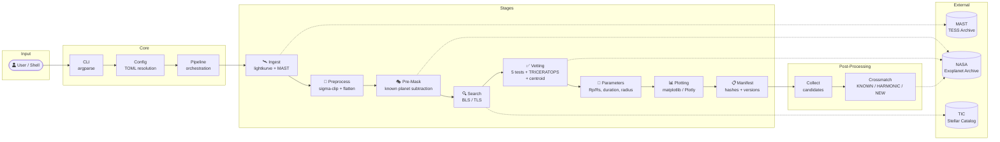
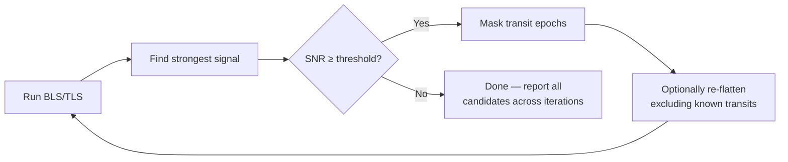

<div align="center">


<br />

[](https://www.python.org)
[](https://github.com/gbFinch/exoplanets-hunting-pipeline/actions)
[](LICENSE)
[](#)

**Exohunt is an end-to-end Python pipeline that downloads TESS satellite photometry,**
**cleans and detrends the light curves, searches for periodic transit dips using BLS and TLS algorithms,**
**automatically vets each candidate through multiple statistical tests, estimates physical planet parameters,**
**and cross-matches results against the NASA Exoplanet Archive — flagging genuinely novel discoveries.**

[Quick Start](#-quick-start) · [Documentation](#-cli-reference) · [Architecture](#-architecture) · [Contributing](#-development)

</div>

<br />

## 📸 Example Outputs

<p align="center">
  
  &nbsp;
  
</p>
<p align="center">
  <sub><b>Left:</b> Density-colored light curve after sigma-clipping and Savitzky-Golay flattening &nbsp;·&nbsp; <b>Right:</b> BLS periodogram with phase-folded transit and odd/even depth comparison</sub>
</p>

---

## 📋 Table of Contents

<details>
<summary>Click to expand</summary>

- [What Exohunt Does](#-what-exohunt-does)
- [Features In Depth](#-features-in-depth)
- [Architecture](#-architecture)
- [Quick Start](#-quick-start)
- [CLI Reference](#-cli-reference)
- [Configuration](#-configuration)
- [Iterative Multi-Planet Search](#-iterative-multi-planet-search)
- [End-to-End Discovery Workflow](#-end-to-end-discovery-workflow)
- [Pre-Built Target Lists](#-pre-built-target-lists)
- [Output Structure](#-output-structure)
- [Reproducibility](#-reproducibility)
- [Documentation](#-documentation)
- [Development](#-development)
- [Acknowledgments](#-acknowledgments)
- [License](#-license)

</details>

---

## 🌍 What Exohunt Does

NASA's TESS satellite monitors hundreds of thousands of stars, recording their brightness every 2 minutes. When a planet crosses in front of its star, it blocks a tiny fraction of light — a **transit dip**. Exohunt automates the entire process of finding these dips and determining whether they're real planets or false alarms.

**The problem it solves:** Manually inspecting TESS light curves is tedious and error-prone. A single star may have years of data across dozens of TESS sectors. Known planets mask weaker signals from undiscovered companions. Instrumental noise, stellar variability, and nearby eclipsing binaries all produce transit-like false positives.

**What Exohunt does about it:**

1. **Downloads** TESS 2-minute cadence photometry from MAST, with intelligent caching so repeat runs skip the download
2. **Cleans** the data — sigma-clipping outliers, Savitzky-Golay flattening to remove stellar variability, with per-sector or stitched processing modes
3. **Masks known planets** — queries the NASA Exoplanet Archive for confirmed planets around each target and subtracts their transit models (using batman Mandel-Agol models when orbital parameters are available, NaN masking otherwise) so the search immediately focuses on new signals
4. **Searches** for periodic transit dips using Box Least Squares (BLS) or Transit Least Squares (TLS), with iterative masking to find multiple planets in the same system
5. **Vets** every candidate through five independent statistical tests to reject false positives
6. **Estimates** physical planet parameters (radius ratio, expected transit duration, duration plausibility) using stellar density from the TIC catalog
7. **Cross-matches** surviving candidates against the NASA Exoplanet Archive, labeling each as KNOWN, HARMONIC, or genuinely NEW
8. **Records** every detail — config hashes, software versions, data fingerprints — so any result can be exactly reproduced

---

## ✨ Features In Depth

### 🔍 Dual Transit Search Engines

<table>
<tr>
<td width="50%">

**Box Least Squares (BLS)**
- Astropy's `BoxLeastSquares` implementation
- Configurable period grid (geometric spacing), duration grid, and SNR threshold
- Candidate refinement pass with 6× denser period grid around each detection
- Bootstrap false-alarm probability (FAP) via flux shuffling (configurable iterations)
- Unique period separation filter to avoid reporting the same signal twice

</td>
<td width="50%">

**Transit Least Squares (TLS)**
- Uses stellar-specific limb-darkened transit models instead of box shapes
- Queries TIC catalog for stellar radius, mass, and computes quadratic limb darkening from Claret tables
- Automatic light curve binning (configurable bin size) to manage TLS runtime on long baselines
- Falls back to solar defaults when catalog data is unavailable
- Multi-threaded execution support

</td>
</tr>
</table>

### 🔄 Iterative Multi-Planet Detection

After each search pass, Exohunt masks the detected transit signal and re-searches the residual light curve. This is critical because:

- The strongest BLS peak is often **not** the most interesting planet — it may be a known hot Jupiter
- Weaker signals from smaller or longer-period planets are buried under sidelobes and harmonics of the dominant signal
- Each iteration can optionally re-flatten the light curve (excluding known transit windows) to remove detrending artifacts

Configurable parameters: number of passes (up to 5+), minimum SNR cutoff, mask padding factor, subtraction model choice.

### ✅ Five-Layer Candidate Vetting

Every candidate passes through **all five** tests before being marked as vetted:

| Test | What It Catches | How It Works |
|:-----|:----------------|:-------------|
| **Minimum transit count** | Spurious single-event detections | Requires N observed transits (configurable threshold) |
| **Odd/even depth test** | Eclipsing binaries with ellipsoidal variations | Compares median transit depth on odd vs even epochs; rejects if mismatch exceeds threshold |
| **Alias/harmonic filter** | Period aliases of stronger signals | Checks if candidate period is a rational multiple (½×, 2×, ⅓×, 3×, ¼×, 4×, ⅕×, 5×) of any higher-power candidate |
| **Secondary eclipse check** | Eclipsing binaries | Measures flux dip at orbital phase 0.5; flags if secondary depth exceeds fraction of primary |
| **Depth consistency** | Instrumental systematics | Splits data into first/second halves; rejects if transit depth differs significantly between halves |

**Plus two optional deep-vetting layers:**

- **TRICERATOPS** (Giacalone & Dressing 2020) — Bayesian false-positive probability modeling across multiple astrophysical scenarios (planet, eclipsing binary, background eclipsing binary, nearby eclipsing binary). Validates if FPP < 0.015 and NFPP < 0.001.
- **Centroid shift analysis** — Compares in-transit vs out-of-transit flux-weighted centroids from Target Pixel Files. A shift > 0.1 pixels (~2.1 arcsec) indicates the signal originates from a nearby contaminating star, not the target.

### 📐 Physical Parameter Estimation

For each vetted candidate, Exohunt estimates:

- **Radius ratio** (Rp/Rs) from transit depth, with optional quadratic limb-darkening correction
- **Planet radius** in Earth radii (using stellar radius from TIC catalog or solar assumption)
- **Expected transit duration** for a central transit given stellar density (from TIC lookup or configurable default)
- **Duration plausibility** — flags candidates where observed duration deviates significantly from physical expectation

### 🛰️ Intelligent Data Handling

- **Two-tier caching** — raw downloads (.npz) and preprocessed light curves are cached separately with parameter-aware keys (outlier sigma + flatten window encoded in the cache path), so changing preprocessing settings doesn't re-download from MAST
- **Per-sector or stitched processing** — independently configurable for preprocessing, plotting, and BLS search. Per-sector mode preserves sector boundaries and avoids cross-sector stitching artifacts
- **Segment manifest tracking** — each downloaded sector is cataloged with segment ID, sector number, author, and cadence for cache integrity
- **Author filtering** — restrict ingestion to specific data products (e.g., SPOC only, or SPOC + QLP)

### 🌐 Known Planet Pre-Masking

Before the first search pass, Exohunt queries the NASA Exoplanet Archive for all confirmed planets around the target:

- **Batman model subtraction** for confirmed planets with published Rp/Rs, a/Rs, and impact parameter — produces a clean residual
- **NaN masking fallback** for TOI candidates or planets without full orbital parameters
- Stellar limb-darkening coefficients from TIC catalog (or solar defaults)

This means the first TLS/BLS pass is immediately sensitive to new, weaker signals instead of wasting iterations rediscovering known planets.

### 📊 Visualization

- **Density-colored scatter plots** — point color intensity scales with local data density (log-scaled histogram binning), making transit dips visually pop against the noise floor
- **Raw vs prepared comparison** — side-by-side plots showing the effect of preprocessing
- **BLS diagnostic panels** — periodogram, phase-folded light curve, odd/even depth comparison, and candidate metadata
- **Interactive HTML plots** (optional, via Plotly) — zoomable, hoverable light curves with configurable downsampling cap
- **Per-sector or stitched** plot modes with sector boundary markers

### 🔄 Resumable Batch Processing

- **`.done` sentinel files** — each completed target writes a sentinel; `--resume` skips targets with existing sentinels
- **JSON state file** (`run_state.json`) — tracks completed targets, failed targets, error messages, and timing
- **CSV status report** — per-target status with runtime, error details, and output paths
- **Live candidate collection** — aggregates candidates across targets as the batch progresses
- **Automatic run directories** — each batch creates a timestamped directory (`YYYY-MM-DDTHH-MM-SS_<preset>_<name>`) with a README summarizing the run configuration

### ⚙️ Engineering Design

Exohunt is built as a production-grade data pipeline, not a collection of scripts:

- **Isolated, timestamped runs** — every execution creates a self-contained directory (`2026-04-30T21-51-10_deep-search_tier1/`) with its own artifacts, config snapshot, and auto-generated README. Runs never overwrite each other; you can compare Tuesday's results against Friday's side by side.
- **Full reproducibility chain** — each run records a config content hash, data fingerprint hash, software versions, and a composite comparison key. Given the same input data and config hash, you get bit-identical outputs.
- **Resumable batch processing** — `.done` sentinel files and a `run_state.json` checkpoint mean you can kill a 27-day batch run and restart exactly where you left off. Failed targets are logged with errors and retried with exponential backoff.
- **Run-to-run comparison** — `comparison.py` provides tools to diff two runs by their comparison keys, detecting changes in preprocessing quality metrics, candidate counts, and vetting outcomes across config or code changes.
- **Deep configurability** — ~40 parameters across 8 config sections (IO, ingest, preprocess, plot, BLS, vetting, parameters, batch), all with validated types, range checks, and deprecated-key rejection. Three built-in presets provide sensible defaults; `init-config` exports any preset as a fully-documented TOML file for customization.
- **Multi-threaded execution** — TLS search supports configurable thread count for parallel period evaluation. Stellar parameter and ephemeris queries use thread-pool executors with timeouts to avoid blocking on slow network calls.
- **Parameter-aware caching** — preprocessing parameters (sigma threshold + flatten window + flatten toggle) are encoded into cache file paths, so changing preprocessing settings serves from the correct cache without re-downloading from MAST. Raw and prepared caches are independent layers.
- **Clean separation of concerns** — strict boundaries between config resolution (pure, deterministic), pipeline orchestration (stateful, side-effectful), domain modules (focused libraries), CLI veneer (thin argparse wrapper), and post-processing aggregation. Each module is independently testable with 17 test files covering ~200 tests.

### 🌐 NASA Archive Cross-Matching

Post-processing step that queries the NASA Exoplanet Archive for each target system:

| Label | Meaning | Action |
|:------|:--------|:-------|
| 🟢 `KNOWN` | Period matches a confirmed exoplanet within 3% | Already discovered — validates pipeline accuracy |
| 🟡 `HARMONIC` | Period matches a rational harmonic (½×, 2×, ⅔×, 3/2×, ⅓×, 3×) of a known planet | Likely an alias — investigate further |
| 🔴 `NEW` | No match in the archive | **Potential novel discovery — worth manual review** |

---

## 🏗 Architecture



<div align="center">
<sub>Single-process, no database, no server. All state lives on the local filesystem under <code>outputs/</code>.</sub>
</div>

<br />

> **Key modules:** `pipeline.py` (orchestration, 1800 LOC) · `config.py` (TOML resolution + validation) · `bls.py` / `tls.py` (search engines) · `vetting.py` (5-test suite) · `validation.py` (TRICERATOPS) · `centroid.py` (TPF analysis) · `batch.py` (multi-target runner) · `collect.py` / `crossmatch.py` (aggregation) · `known_transit_masking.py` (batman model subtraction) · `parameters.py` (physical estimates) · `stellar.py` (TIC queries) · `ephemeris.py` (NASA archive queries)

---

## 🚀 Quick Start

### Prerequisites

- Python ≥ 3.10
- Internet access (MAST / NASA archive queries)

### Install

```bash
git clone https://github.com/gbFinch/exoplanets-hunting-pipeline.git
cd exoplanets-hunting-pipeline

python -m venv .venv
source .venv/bin/activate
pip install -e .
```

<details>
<summary><b>Optional extras</b></summary>

```bash
pip install -e ".[plotting]"   # Plotly interactive HTML plots
pip install -e ".[dev]"        # ruff, pytest, mypy, pre-commit
```

</details>

### Run your first target

```bash
python -m exohunt.cli run --target "TIC 261136679" --config quicklook
```

> 💡 This downloads TESS 2-min cadence data from MAST, sigma-clips outliers, flattens stellar variability, runs BLS transit search, vets candidates through 5 statistical tests, estimates planet parameters, generates diagnostic plots, and writes all artifacts to `outputs/` — in one command.

---

## 📖 CLI Reference

<details open>
<summary><b>Single target analysis</b></summary>

```bash
python -m exohunt.cli run --target "TIC 261136679" --config science-default
```

</details>

<details>
<summary><b>Batch mode (resumable)</b></summary>

```bash
python -m exohunt.cli batch \
  --targets-file .docs/targets_premium.txt \
  --config science-default \
  --resume
```

Targets file format — one per line, blank lines and `#` comments ignored:

```text
TIC 261136679
TIC 172900988
TIC 139270665
```

</details>

<details>
<summary><b>Initialize a custom config from a preset</b></summary>

```bash
python -m exohunt.cli init-config --from science-default --out ./configs/myrun.toml
```

</details>

<details>
<summary><b>Post-processing: collect and cross-match</b></summary>

```bash
python -m exohunt.collect                    # Aggregate all passed candidates
python -m exohunt.collect --iterative-only   # Only candidates from iteration ≥ 1
python -m exohunt.collect --all              # Include failed vetting too
python -m exohunt.crossmatch                 # Cross-reference NASA Exoplanet Archive
```

</details>

---

## ⚙ Configuration

Exohunt uses TOML configuration with three built-in presets:

| Preset | Use Case | Search | BLS Iterations | Period Range | Vetting |
|:-------|:---------|:------:|:--------------:|:------------:|:-------:|
| 🟢 `quicklook` | Fast inspection | BLS | 1 | 0.5 – 20 d | Basic |
| 🔵 `science-default` | Balanced analysis | BLS | 1 | 0.5 – 20 d | Full |
| 🟣 `deep-search` | Multi-planet hunt | BLS | 3 | 0.5 – 25 d | Full |

Every parameter is independently configurable — preprocessing (sigma threshold, flatten window, per-sector vs stitched), search (period/duration grids, SNR cutoff, BLS vs TLS), vetting (transit count threshold, odd/even tolerance, TRICERATOPS on/off), and parameter estimation (stellar density source, limb darkening coefficients, duration plausibility bounds).

```bash
python -m exohunt.cli init-config --from deep-search --out ./configs/custom.toml
```

> 📄 See [`examples/config-example-full.toml`](examples/config-example-full.toml) for all ~40 configurable fields with inline documentation.

---

## 🔄 Iterative Multi-Planet Search

After each search pass, Exohunt masks the detected transit and re-searches the residual — recovering secondary planets hidden under the primary signal's sidelobes and harmonics.



**Why this matters:** In a system with a known hot Jupiter (deep, short-period transit), the BLS periodogram is dominated by that signal's power, sidelobes, and harmonics. Without iterative masking, smaller planets at longer periods are invisible. With it, each pass peels away one layer, exposing progressively weaker signals.

<details>
<summary><b>Enable iterative search</b></summary>

```toml
# configs/iterative.toml
schema_version = 1
preset = "science-default"

[bls]
iterative_masking = true
iterative_passes = 5
min_snr = 5.0
n_periods = 4000
period_max_days = 25.0
```

Or use the `deep-search` preset which enables iterative BLS by default (3 passes).

</details>

---

## 🔬 End-to-End Discovery Workflow

```bash
# 1️⃣  Run batch analysis on high-value targets
python -m exohunt.cli batch \
  --targets-file .docs/targets_premium.txt \
  --config ./configs/iterative.toml \
  --resume --no-cache

# 2️⃣  Collect all passed candidates into a single summary
python -m exohunt.collect

# 3️⃣  Cross-reference against NASA Exoplanet Archive
python -m exohunt.crossmatch

# 4️⃣  (Optional) Clean light curve cache to reclaim disk space
rm -rf outputs/cache/lightcurves
```

The collect step produces `outputs/candidates_summary.json` with every vetted candidate across all targets. The crossmatch step queries the NASA Exoplanet Archive and labels each:

| Label | Meaning | Action |
|:------|:--------|:-------|
| 🟢 `KNOWN` | Period matches a confirmed exoplanet (within 3%) | Validates pipeline accuracy |
| 🟡 `HARMONIC` | Matches a rational harmonic (½×, 2×, ⅔×, 3/2×, ⅓×, 3×) | Likely an alias — investigate |
| 🔴 `NEW` | No match in the archive | **Potential novel discovery** |

---

## 🗂 Pre-Built Target Lists

Curated from the [ExoFOP](https://exofop.ipac.caltech.edu/tess/) TOI catalog — single-TOI systems (1 known planet, no eclipsing binaries) sorted by TESS sector count. The iterative BLS masks the known planet and searches for additional signals.

| Tier | File | Targets | Criteria | Est. Runtime |
|:----:|:-----|--------:|:---------|:------------:|
| 🥇 | [targets_premium.txt](.docs/targets_premium.txt) | ~200 | Tmag < 11, ≥ 10 sectors | ~40 hours |
| 🥈 | [targets_standard.txt](.docs/targets_standard.txt) | ~1,100 | Tmag < 13, ≥ 5 sectors | ~9 days |
| 🥉 | [targets_extended.txt](.docs/targets_extended.txt) | ~1,900 | Tmag < 14, ≥ 3 sectors | ~16 days |
| 🌐 | [targets_all.txt](.docs/targets_iterative_search.txt) | ~3,200 | All tiers combined | ~27 days |

> **💡 Tip:** Start with premium, then expand. The `--resume` flag skips already-processed targets.

---

## 📁 Output Structure

```
outputs/
├── 📂 cache/lightcurves/           # Downloaded TESS data (.npz), parameter-keyed
├── 📂 runs/<timestamp>_<preset>/   # One directory per batch run
│   ├── 📂 <target>/
│   │   ├── 📊 plots/              # Density-colored light curves, BLS diagnostics
│   │   ├── 🔍 candidates/         # Ranked candidates (CSV + JSON) with vetting results
│   │   ├── 🩺 diagnostics/        # Phase-fold plots, odd/even comparisons per candidate
│   │   ├── 📈 metrics/            # Preprocessing quality metrics (RMS, MAD, trend ratios)
│   │   └── 📋 manifests/          # Run config hash, data fingerprint, comparison key
│   ├── 📄 batch_status.csv         # Per-target status, runtime, errors
│   └── 📄 run_state.json           # Resumable checkpoint state
├── 📄 candidates_summary.json      # Aggregated candidates (from collect)
└── 📄 candidates_crossmatched.json # With KNOWN/HARMONIC/NEW labels (from crossmatch)
```

<details>
<summary><b>Example candidate JSON</b></summary>

```json
{
  "metadata": {
    "target": "TIC 261136679",
    "run_utc": "2026-04-30T21:51:10+00:00",
    "config_hash": "cf473890ae95",
    "bls_mode": "stitched",
    "n_points_prepared": 142857
  },
  "candidates": [
    {
      "rank": 1,
      "period_days": 1.567,
      "duration_hours": 2.34,
      "depth_ppm": 43.99,
      "snr": 12.4,
      "power": 0.0023,
      "transit_count_estimate": 287,
      "vetting_pass": false,
      "vetting_reasons": "odd_even_depth_mismatch",
      "iteration": 0,
      "odd_depth_ppm": 52.1,
      "even_depth_ppm": 35.8,
      "secondary_eclipse_depth_fraction": 0.02,
      "radius_ratio_rp_over_rs": 0.0066,
      "radius_earth_radii": 0.73
    },
    {
      "rank": 2,
      "period_days": 6.268,
      "duration_hours": 3.12,
      "depth_ppm": 179.90,
      "snr": 8.7,
      "power": 0.0018,
      "transit_count_estimate": 72,
      "vetting_pass": true,
      "vetting_reasons": "pass",
      "iteration": 1,
      "radius_ratio_rp_over_rs": 0.0134,
      "radius_earth_radii": 1.48
    }
  ]
}
```

> The `iteration` field shows which BLS pass found the candidate (`0` = first pass, `1+` = after masking prior signals). Rank 1 failed vetting due to odd/even depth mismatch (likely an eclipsing binary), while rank 2 — found only after masking rank 1 — passed all tests with an estimated radius of 1.48 R⊕.

</details>

---

## 🔒 Reproducibility

Every run records a complete provenance chain:

| Artifact | Purpose |
|:---------|:--------|
| `RuntimeConfig` snapshot | Exact TOML parameters used, including resolved preset defaults |
| Software versions | Python version + all dependency versions (lightkurve, astropy, numpy, etc.) |
| Config content hash | SHA-256 of the resolved configuration for exact matching |
| Data fingerprint hash | Hash of input light curve data to detect upstream changes |
| Comparison key | Composite key enabling automated run-to-run diff |
| Manifest index | CSV row per target per run, enabling cross-run queries |

Manifests: `outputs/<target>/manifests/` · Index: `outputs/manifests/run_manifest_index.csv`

---

## 📚 Documentation

Detailed technical documentation lives in [`.agents/summary/`](.agents/summary/). Start with the [index](.agents/summary/index.md) — it routes you to the right doc for any question.

| Document | Covers |
|:---------|:-------|
| [**Codebase Info**](.agents/summary/codebase_info.md) | Project identity, directory structure, entry points, CI setup |
| [**Architecture**](.agents/summary/architecture.md) | System design, staged pipeline flow, caching architecture, reproducibility design |
| [**Components**](.agents/summary/components.md) | Module-by-module responsibilities — where does X live? |
| [**Interfaces**](.agents/summary/interfaces.md) | CLI surface, Python APIs, config schema, artifact contracts, external integrations |
| [**Data Models**](.agents/summary/data_models.md) | Dataclass fields, CSV columns, JSON schemas |
| [**Workflows**](.agents/summary/workflows.md) | End-to-end recipes — how to run a search, batch analysis, cross-matching |
| [**Dependencies**](.agents/summary/dependencies.md) | Third-party libraries, network calls, dev tooling |
| [**Review Notes**](.agents/summary/review_notes.md) | Doc gaps, assumptions, areas to double-check |

---

## 🛠 Development

```bash
pip install -e ".[dev]"        # Install dev dependencies
pytest                          # Run tests (17 test files, ~200 tests)
ruff check .                    # Lint
pre-commit install              # Set up hooks
pre-commit run --all-files      # Run all hooks
```

CI runs lint + tests on **Python 3.10** and **3.11** via GitHub Actions.

<details>
<summary><b>Project layout</b></summary>

```
src/exohunt/
├── cli.py                  # CLI entry point (argparse) — run, batch, init-config
├── config.py               # TOML config resolution, validation, preset management
├── pipeline.py             # Five-stage per-target orchestration (~1800 LOC)
├── batch.py                # Multi-target runner with checkpointing and status reports
├── bls.py                  # Box Least Squares — search, refinement, iterative masking
├── tls.py                  # Transit Least Squares — stellar-aware search with binning
├── vetting.py              # 5-test candidate vetting suite
├── validation.py           # TRICERATOPS Bayesian false-positive probability
├── centroid.py             # TPF centroid shift analysis for contamination detection
├── known_transit_masking.py # Batman model subtraction of known planets
├── preprocess.py           # Sigma-clipping, Savitzky-Golay flattening, quality metrics
├── ingest.py               # MAST data ingestion, segment extraction, stitching
├── plotting.py             # Density-colored plots, diagnostics, interactive HTML
├── collect.py              # Candidate aggregation across targets
├── crossmatch.py           # NASA Exoplanet Archive cross-referencing
├── stellar.py              # TIC stellar parameter queries + limb darkening
├── ephemeris.py            # NASA archive ephemeris queries with retry logic
├── parameters.py           # Physical parameter estimation (Rp/Rs, radius, duration)
├── cache.py                # Two-tier caching with parameter-aware keys
├── manifest.py             # Run manifest generation and comparison tracking
├── models.py               # Data models (IngestResult, SearchResult, etc.)
├── metrics_io.py           # Preprocessing quality metric I/O
├── candidates_io.py        # Candidate output serialization (CSV + JSON)
├── comparison.py           # Run-to-run comparison tools
├── progress.py             # Terminal progress rendering
└── presets/                # Built-in TOML presets (quicklook, science-default, deep-search)
```

</details>

---

## 🙏 Acknowledgments

This project uses data from:

<table>
<tr>
<td align="center" width="33%">
<a href="https://tess.mit.edu/"><b>TESS</b></a><br/>
<sub>Transiting Exoplanet Survey Satellite</sub><br/>
<sub>via <a href="https://mast.stsci.edu/">MAST</a> archive</sub>
</td>
<td align="center" width="33%">
<a href="https://exoplanetarchive.ipac.caltech.edu/"><b>NASA Exoplanet Archive</b></a><br/>
<sub>Confirmed planet cross-matching</sub><br/>
<sub>and ephemeris queries</sub>
</td>
<td align="center" width="33%">
<a href="https://exofop.ipac.caltech.edu/tess/"><b>ExoFOP</b></a><br/>
<sub>Target-of-interest catalog</sub><br/>
<sub>curation and target lists</sub>
</td>
</tr>
</table>

Built with [lightkurve](https://docs.lightkurve.org/) · [astropy](https://www.astropy.org/) · [transitleastsquares](https://github.com/hippke/tls) · [TRICERATOPS](https://github.com/stevengiacalone/triceratops) · [batman](https://github.com/lkreidberg/batman)

---

<div align="center">

**[MIT](LICENSE) © gbFinch**

⭐ Star this repo if you find it useful!

</div>
