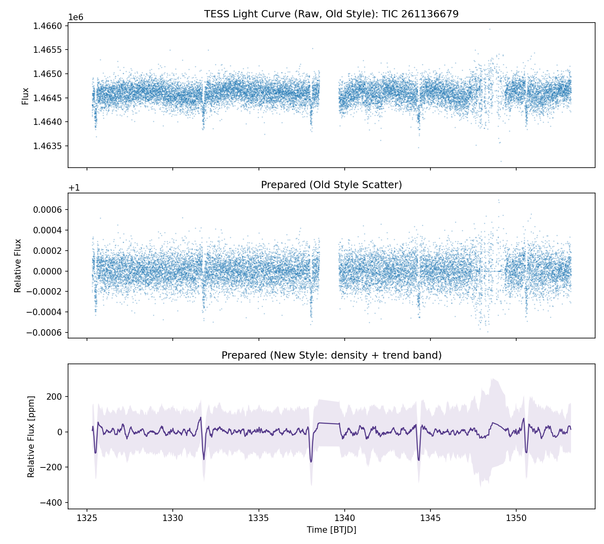
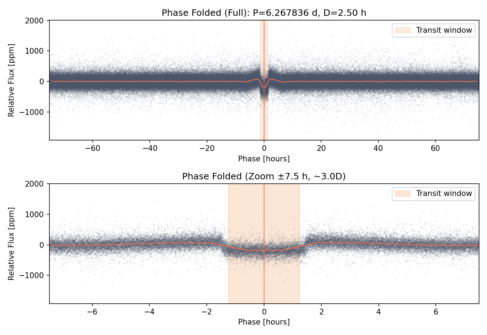

# Exohunt


Tools for ingesting, preprocessing, plotting, and transit-searching TESS light curves.

## Why Exohunt

- Built for repeatable exoplanet light-curve workflows.
- Supports single-target and resumable multi-target batch analysis.
- Produces deterministic artifacts: plots, candidate tables, diagnostics, and manifests.
- Includes built-in runtime presets for quick inspection through deeper search.

## Example Screenshots

These are illustrative examples showing the type of outputs Exohunt generates.




## Quick Start

### 1. Install

```bash
python -m venv .venv
source .venv/bin/activate
pip install -e .
```

Optional extras:

```bash
pip install -e .[plotting]   # Plotly interactive HTML plots
pip install -e .[dev]        # lint/test tooling
```

### 2. Run a target

```bash
python -m exohunt.cli run --target "TIC 261136679" --config science-default
```

### 3. Start from a config file

```bash
python -m exohunt.cli init-config --from science-default --out ./configs/myrun.toml
python -m exohunt.cli run --target "TIC 261136679" --config ./configs/myrun.toml
```

Reference: `examples/config-example-full.toml`

## Built-In Presets

- `quicklook`: fast inspection
- `science-default`: balanced, default workflow
- `deep-search`: heavier search with optional interactive plotting

## CLI Usage

Single target:

```bash
python -m exohunt.cli run --target "TIC 261136679" --config quicklook
```

Batch mode (resumable):

```bash
python -m exohunt.cli batch --targets-file .docs/targets.txt --config science-default --resume
```

Example targets file:

```text
# One target per line. Blank lines/comments are ignored.
TIC 261136679
TIC 172900988
TIC 139270665
```

## Output Layout

Exohunt writes analysis artifacts under `outputs/`:

```text
outputs/
  cache/lightcurves/...
  <target>/
    plots/
    candidates/
    diagnostics/
    metrics/
    manifests/
  metrics/preprocessing_summary.csv
  manifests/run_manifest_index.csv
  batch/
```

Notable artifacts:

- Plots: `outputs/<target>/plots/`
- BLS candidates (CSV/JSON): `outputs/<target>/candidates/`
- Candidate diagnostics: `outputs/<target>/diagnostics/`
- Run manifests and comparison keys: `outputs/<target>/manifests/`
- Batch status reports and resumable state: `outputs/batch/`

## Candidate JSON Example

Real example source:
`outputs/tic_261136679/candidates/tic_261136679__bls_cf473890ae95.json`

Curated example file:
`examples/output-example-candidates.json`

```json
{
  "candidates": [
    {
      "rank": 1,
      "period_days": 1.5669543338043215,
      "depth_ppm": 43.98520228435891,
      "vetting_pass": false,
      "vetting_reasons": "odd_even_depth_mismatch"
    },
    {
      "rank": 2,
      "period_days": 6.267835516128348,
      "depth_ppm": 179.90382892442165,
      "vetting_pass": true,
      "vetting_reasons": "pass"
    }
  ]
}
```

This demonstrates an important behavior: the strongest-ranked BLS peak is not always the real planet candidate, so vetting fields should drive interpretation.

## Reproducibility

Each run records:

- runtime configuration and preset metadata
- software versions
- data/config fingerprint hashes
- manifest index rows for run-to-run comparisons

## Development

Run tests:

```bash
pytest
```

Lint:

```bash
ruff check .
```

## Notes

- Python requirement: `>=3.10`
- This project is currently experimental and evolving
